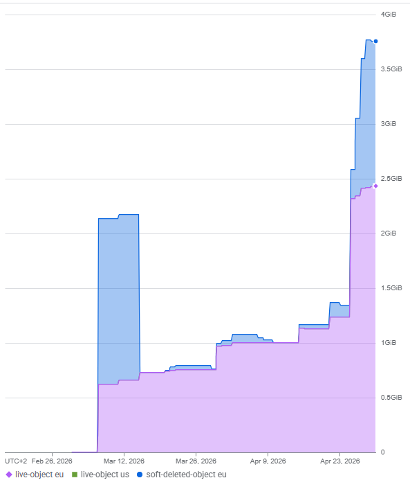
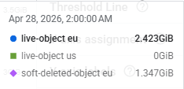
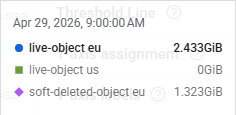
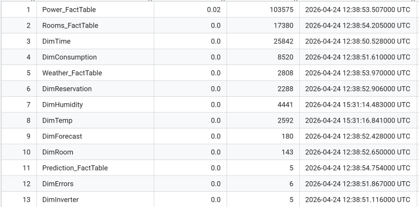
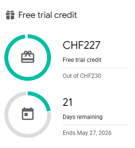
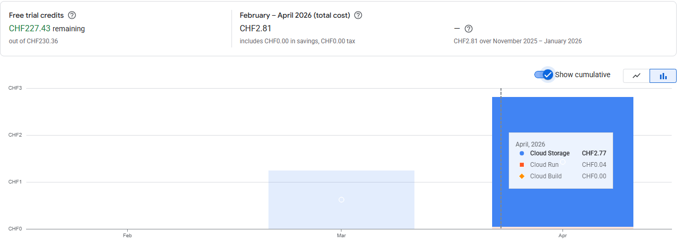
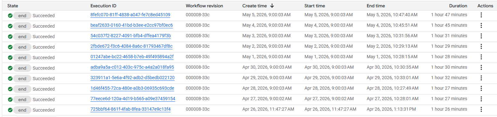

# Scalability

This file analyses current performance metrics and identified vulnerabilities of our solution in the future. For a more detailed explanation of the solution architecture, please read `technical_documentation.md`

## Data lake
### Storage needs
This solution is utilising a single storage bucket for the bronze and silver layer of a medallion architecture solution. We only store our most recent data, meaning we are not archiving historical versions. This is due to storage limitations in our GCP project, as we have created this project withing the scope of GCP's 90 day free trial. For a production environment, data archival and backup would be a highly recommended addition. This could be set up in GCP, or done locally.

This chart display our bucket's total storage

Once our workflow was fully automated towards the end of April, we can see that the storage doesn't grow dramatically per day:

This means the size of our lake grows by about ~0.04%. Assuming we don't have more data, our storage needs would be doubling in **4.75** years (1,773 days)

### New data

If you have some kind of additional data, all you would need to do is create the bronze, silver and gold tier scripts, and add them to the steps of `dailyworkflow.yml`.

The schema of the data warehouse would need to be changed and the data moved back in. This can be done with the scripts `kill_tables.sql`, `make_tables.sql`, and `backfill.py`, in that order.

## Data warehouse

Our data warehouse is hosted in Google's BigQuery service. Our free tier entitles us to 10GB of storage and 1TB of data processed per month. As of May 5th, with all data from 1.1.2023 - 5.5.2023 we are using **0.02GB**

 

## GCP Billing

During our project we have used ~3 CHF worth of our 230 CHF in free credit given to us in the free tier of GCP.

Since we only store data in GCP, we save in costs by utilising the provided VM for all of our compute power.

This chart depicts our usage cumulatively from February to April. Cloud Storage is our main expense, specifically moving data out of it when we run our pipeline. Cloud run expenses are a remnant of when were running our gold layer of the pipeline within GCP, and would not appear in a separate instance of this solution.

Cloud Storage costs were 1.24 CHF for March, and 1.53 CHF for April, which is a **23.4**% increase over 30 days. Naively assuming that the rate costs increase is constant, with compounding growth our monthly expense in February 2024 would be 15.45 CHF / month. Another year at the same rate and our storage expense per month would be **192.6** CHF. Depending on the organisation's budget and for how long they intend to store this data, it may be worth moving some of the data to an archival service like Google Cloud Archive.

## Workflow time

Currently, the workflow execution time increases as more data has to be dealt with

 

From April 26th to May 5th the execution time has increased by **24.4** %

This can be attributed to how the powershell scripts operate, where they iterate over every single day in a date range. For a production environment, it would be necessary to use more efficient indexing.

## Conclusion

Evidently the only inherent problem to scalability is the powershell commands. Replacing them with something faster would leave the solution in a very scalable state.

All charts and visuals in this document were taken straight from the Billing, Cloud Storage and BigQuery interfaces in GCP.
