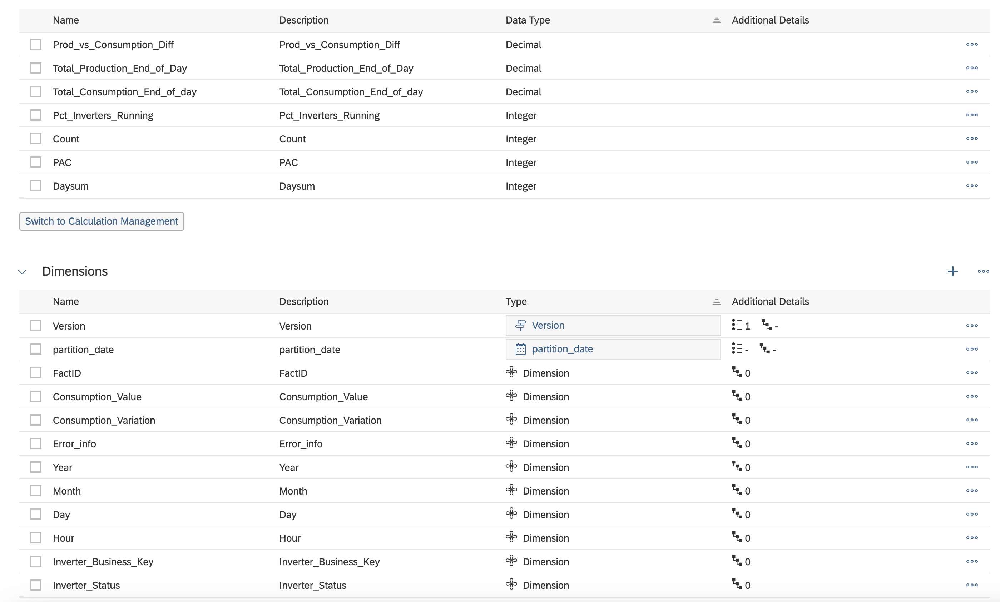
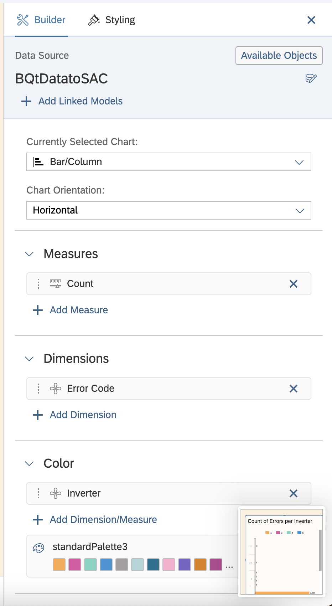
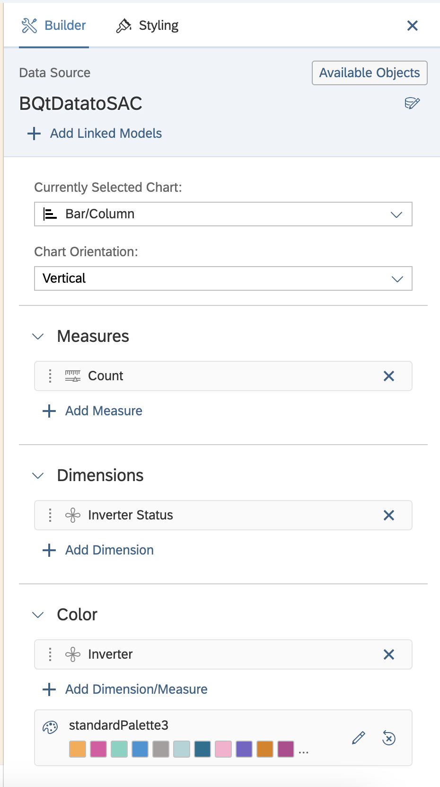

# DataCycleProject – Deployment Setup Guide

This guide describes how to deploy the DataCycleProject using the provided `deploy.bat` automation script and configure the associated visualization dashboards.

---

## 1. Prerequisites
Before running the deployment script, ensure your **Windows VM** has the following installed:

* **Python 3.11+**: Must be accessible via the `py` launcher [cite: 2, 16].
* **Google Cloud SDK**: Includes `gcloud` and `gsutil` command-line tools [cite: 3, 4].
* **Accounts**:
    * A Google Cloud Platform (GCP) account.
    * A KNIME EduHub or BusinessHub account.
* **Permissions**: Administrative privileges on the VM to register scheduled tasks [cite: 18].

## 2. Infrastructure Preparation

### Google Cloud Platform (GCP)
Set up the following resources in your GCP console:
1.  **Cloud Storage Bucket**: For data storage.
2.  **BigQuery Dataset**: For analytics.
3.  **Pub/Sub Topic & Subscription**: For event-driven processing.
4.  **Service Account**: Create a service account, generate a **JSON key**, and download it to your VM [cite: 14, 15].

### KNIME
1.  Import the `Group4EnergyPredictions.knwf` workflow into your Hub space.
2.  Deploy the workflow as a **service** to enable API access.
3.  Note the **App ID**, **Password**, and **Deployment URL** [cite: 7, 11, 12].

Before running the next step, run the command `Install-Module -Name ImportExcel -Force -Scope CurrentUser` in a Powershell terminal as administrator.
---

## 3. Automated Deployment Steps

1.  **Extract the Solution**: Unzip the project files into a directory on your VM.
2.  **Initial Run**: Execute `deploy.bat` from the root directory [cite: 1]. The script will create a `.env` file from a template if one does not exist [cite: 6].
3.  **Configuration**: Open `.env` and fill in the required values, ensuring placeholders are replaced [cite: 6, 8, 9, 10, 11, 12]:
    * `GCP_PROJECT`: Your GCP project ID.
    * `GCS_BUCKET`: Your GCS bucket name.
    * `GOOGLE_APPLICATION_CREDENTIALS`: Path to your service account JSON key.
    * `ROOT_DIR`: The project's root directory on the VM.
    * `SFTP_PASS`: Your SFTP password.
    * `KNIME_ID` & `KNIME_PASSWORD`: Your KNIME credentials.
    * `KNIME_DEPLOYMENT_URL`: The URL for your deployed service.
4.  **Finalize Deployment**: Run `deploy.bat` again. The script will:
    * Install Python dependencies for the root and `gold-layer-etl` modules [cite: 16, 17].
    * Register a Windows Task Scheduler task named `DataCycleProject-Manager` to run `start_manager.bat` daily at **08:50** [cite: 18, 19].
    * Perform a GCP credentials smoke test [cite: 20].

---

## 4. Dashboard Setup

Once the pipeline has populated your BigQuery dataset, you can set up the visualizations using the provided files.

### Power BI
Two files are provided in the solution folder:
* **`.pbit` (Template)**: Recommended for first-time setup. Opening this will prompt you to enter your **GCP Project ID** and **Dataset Name**. It will then build the schema and ask you to authenticate with your Google account.
* **`.pbix` (Report)**: Use this to view the report with existing layouts. If data does not appear, go to **Transform Data > Data Source Settings** and update the BigQuery connection to point to your project.

### SAP Analytics Cloud (SAC)
SAC uses a transport system rather than a "local file" workflow. To import the dashboard:
1.  Log in to your **SAC Tenant**.
2.  Navigate to **Deployment > Import**.
3.  Select **Upload** and choose the provided **`.tgz`** package.
4.  Once uploaded, select the package and click **Import**. This will recreate the Story and the required Models.
5.  **Note**: After importing, you must update the **Data Connection** within SAC to use your specific BigQuery service account credentials.

For this project our user doesn't have the permission to export stories so we can't share the file. These screenshots will contain all the configurations for the different elements in the dashboard:

Dimensions and measures in model:

Count of Errors per Inverter 

Count of status codes

---

## 5. Maintenance
* **Manual Start**: Execute `start_manager.bat` to run the pipeline immediately 
* **GCP Auth**: If the smoke test fails, run `gcloud auth application-default login`